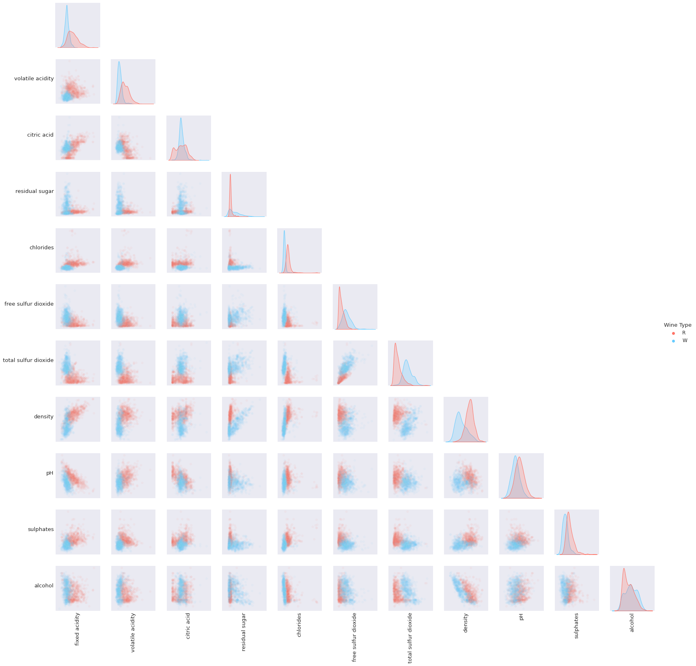
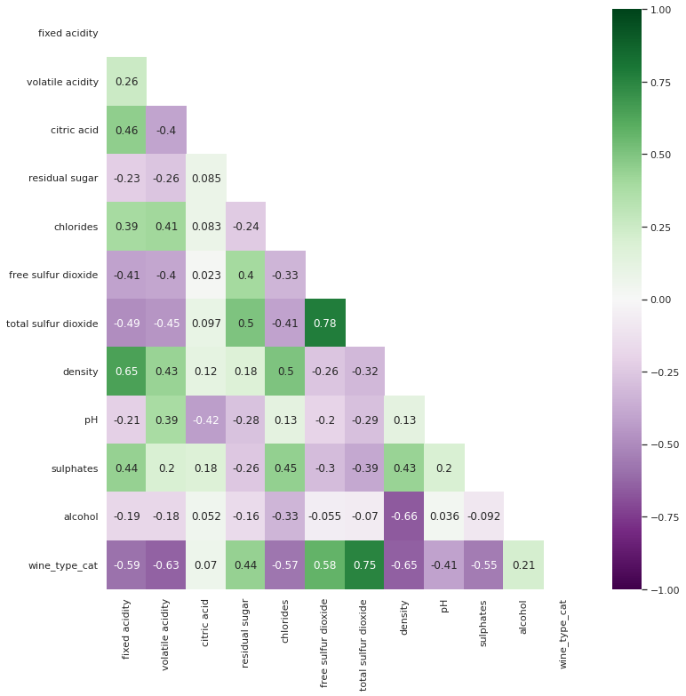
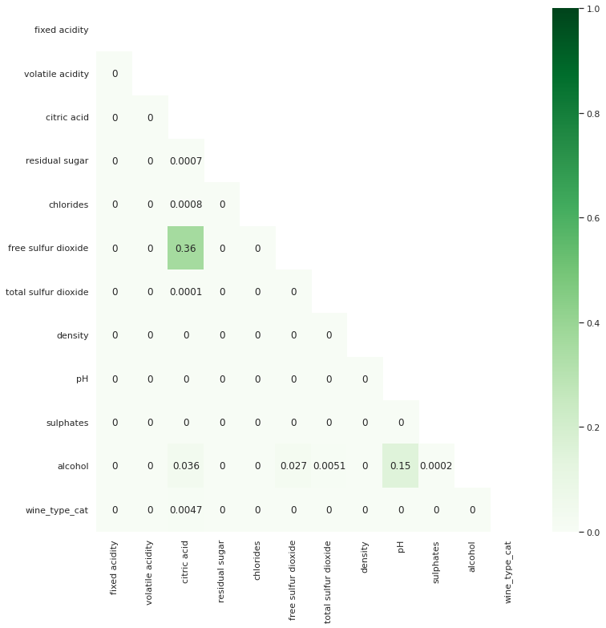
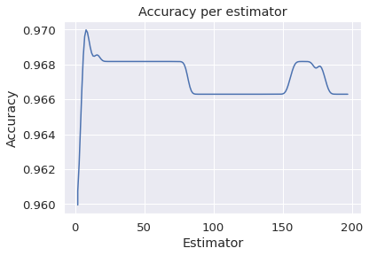
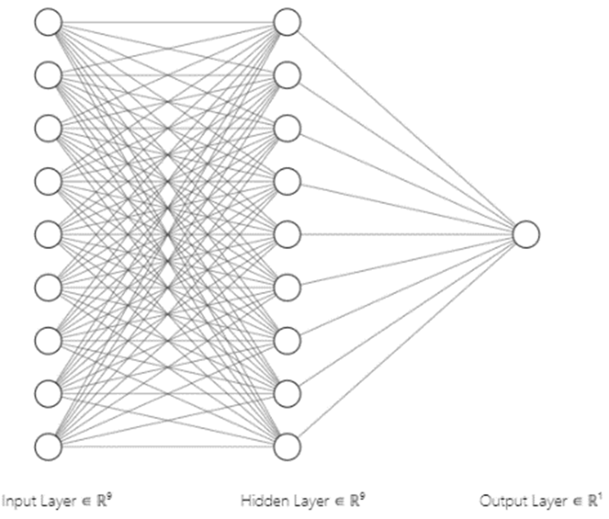
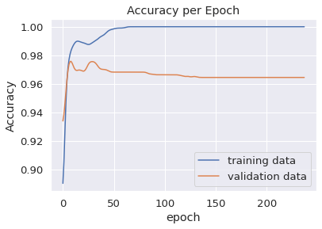
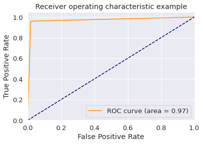

# Wine Classification
This project was conducted in semester 1 2021 as part of a university unit.

The aim of this project was to perform classification of wine as either white or red using the 
of mushrooms as edible or poisonous using the "Mushroom Data Set" submitted to the UCI Machine Learning Repository [5]. The dataset was modified by the unit to prevent plagiarism.

# Contents

- [Wine Classification](#wine-classification)
- [Contents](#contents)
- [Data cleaning and preparation](#data-cleaning-and-preparation)
  - [Cleaning](#cleaning)
  - [Preparation](#preparation)
  - [Correlation](#correlation)
- [Choosing and Training models](#choosing-and-training-models)
  - [Random Forest Classifiers](#random-forest-classifiers)
  - [Neural Networks](#neural-networks)
  - [Support Vector Machines](#support-vector-machines)
  - [Stacking Ensemble](#stacking-ensemble)
  - [Choosing a model](#choosing-a-model)
  - [Evaluating the model](#evaluating-the-model)
- [References](#references)

# Data cleaning and preparation

## Cleaning
The raw data contains exactly 2000 record, 11 continuous attributes, and a categorical attribute denoting wine type. Looking at histograms indicates that attributes are normally distributed although many are skewed. No data included null values and there were no suspicious peaks that indicated a number was being used to stand-in for null values.

On close inspection of the data, I found that it contained repeated rows that will need to be removed.

The distribution of wine types is 48% white and 52% red which while not perfectly balanced is good enough to not require correction.

## Preparation

The 383 duplicated rows were removed using pandas&#39; inbuilt duplicate removal method.

The wine type was converted to ordinal encoding as all classification methods use ordinal encoding for categorical variables. Red wine was encoded as 0 and white wine was encoded as 1.

## Correlation
To determine if any correlations were obvious a scatter pair plot was generated:

Most variables are clearly correlated and there are no combinations of two variables that clearly separate the wine types. Hence a heatmap of the correlation between variables was produced using Pearson&#39;s correlation coefficient to visualize more clearly the correlations between each variable:

The most notable takeaways here are many variables are strongly associated with wine type and there are some strong correlations that can be investigated. Free sulfur dioxide is strongly correlated with total sulfur dioxide indicating it may be valuable to remove one of these attributes. Citric acid and alcohol are weakly correlated with wine\_type and moderately to strongly correlated with other variables hence they are good candidates for removal. However, when removing data that is at all correlated with the answer information is lost and hence the possible accuracy of the model is reduced. Hence a short test was conducted to determine if the inclusion of these variables would hinder or benefit the models.

| Variables Removed | Artificial Feed-forward Neural Network (Accuracy) | Random Forest Classifier (Accuracy) |
| --- | --- | --- |
| None | 97.8% | 97.4% |
| Alcohol, citric acid | 97.4% | 97.2% |
| Alcohol, citric acid, free sulfur dioxide | 97.8% | 97.2% |

As there is no significant difference between any action, I chose to remove Alcohol, and citric acid. This option was chosen as less attributes results in a shorter training time while not potentially removing valuable data.

# Choosing and Training models

The input for whatever model is chosen should be an array of values corresponding to each attribute in the dataset. The output should be a single value of either 0 or 1 matching the encoding wine type. As this is a classification problem with continuous variables the most common options are feed-forward neural networks, random forest classifiers, and support vector machines.

## Random Forest Classifiers

Random forest classifiers are a classical strong solution that is formed as an ensemble of decision trees which vote to determine the classification. In practice this is implemented via the sci-kit learn library and requires the number of estimators to be specified. I expected the best number of estimators to be relatively low as there are not a significant number of attributes and in testing this was infect the case.

6 Estimators gave the best result in this case and hence for future comparisons 6 estimators will be used.

## Neural Networks

Neural networks are the modern solution to this form of classification problem however usually best perform with large numbers of attributes and very large numbers of rows. Many different networks were tested to gain an understanding of what networks best fit the problem. All networks followed the structure: input layer equal to size of input set, a number of hidden layers of a certain size, and an output layer with a single neuron.

| Layer number | Neurons per layer | Epocs | Accuracy (%) | Precision (%) | Recall (%) | F1 |
| --- | --- | --- | --- | --- | --- | --- |
| 2 | 3 | 200 | 92.3 | 90.5 | 93.7 | 0.921 |
| 2 | 9 | 200 | 92.5 | 90.6 | 94.1 | 0.923 |
| 2 | 3 | 1000 | 97.0 | 96.5 | 97.3 | 0.969 |
| 2 | 9 | 1000 | 97.4 | 97.3 | 97.3 | 0.973 |
| 1 | 9 | 2000 | 97.6 | 97.3 | 97.6 | 0.975 |
| 2 | 9 | 2000 | 97.4 | 97.6 | 96.9 | 0.972 |
| 10 | 9 | 2000 | 97.4 | 96.9 | 97.6 | 0.973 |
| 2 | 20 | 2000 | 97.0 | 96.1 | 97.6 | 0.969 |

From this testing I determined that the network I would use would be a single hidden layer of 9 neurons trained for 2000 epocs. This is a relatively simple network that allows for a relatively quick training process.

## Support Vector Machines

Support vector machines initially seemed like a strong option however in preliminary tests they were unable to reach an accuracy greater than 85% and hence were significantly inferior compared to other options.

## Stacking Ensemble

As both random forest classifiers and neural networks produce strong and roughly equivalent results a stacking model may produce an accuracy stronger than their constituent parts. Random forest classifiers however do not work in ensembles as they produce a binary result so a random forest regressor is used instead. Hence, I trained a neural network meta model on the output from the neural network and on a random forest regressor. This model failed to produce a significantly superior result and on average produced worse results as it began to overfit the training data. Hence, I chose to not peruse a stacking ensemble.

## Choosing a model

I chose to use k-fold cross validation when training my model and split the dataset into 10 portions. I then averaged the output from the neural network and from the random forest classifier over the full cross validation to compare the overall results:

| Model | Accuracy | Precision | Recall | F1-score |
| --- | --- | --- | --- | --- |
| Neural Network | 97.0% | 96.9% | 96.9% | 0.969 |
| Random Forest | 97.2% | 98% | 96.0% | 0.970 |

I chose to use a random forest classifier as the two models are practically identical in capability and random forest takes a vastly shorter amount of training time.

## Evaluating the model

The confusion matrix shows white wines are twice as likely to be predicted wrongly compared to red wines, however, as the result of a false positive or false negative is not terrible the most important factor to consider is accuracy. An accuracy of 97% is good however when looking at some records that were misclassified by the model, they appeared very close to wines of the other variety indicating they may have been mislabeled or are just extremely similar wines.

The model has an AUC of 0.971 meaning the model is close to perfect and this can be seen in the ROC graph.

|          | Predicted    |     Real    |              |
|----------|--------------|-------------|--------------|
|          |              |     Red     |     White    |
|          |     Red      |     831     |     31       |
|          |     White    |     15      |     740      |

# References
[My google colab document](https://colab.research.google.com/drive/1Si9HikXRi2MeUbVRxrM4iHt6_-MQYV5P?usp=sharing)

Used as a refence when data cleaning:

Keim, A., 2016. _Red vs White Wine Analysis_. \[online] Rstudio-pubs-static.s3.amazonaws.com. Available at: &lt;https://rstudio-pubs-static.s3.amazonaws.com/181576\_5f67bf5eecab4236a44607d960db7d34.html&gt; [Accessed 20 May 2021].

Used for drawing the neural network:

Alexlenail.me. 2021. _NN SVG_. \[online] Available at: &lt;http://alexlenail.me/NN-SVG/index.html&gt; [Accessed 25 May 2021].

